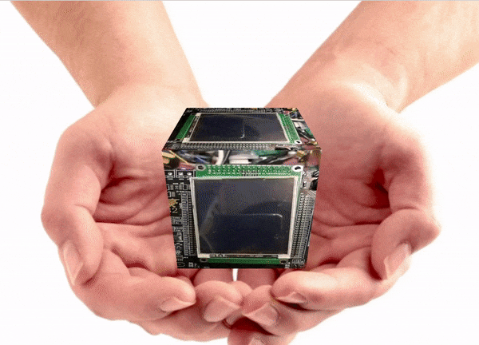

# GuiLiteWeb

## Introduction
- [GuiLite](https://github.com/idea4good/GuiLite) is the smallest GUI library with 5000 lines of C++ code, it runs on **all platforms**(e.g, iOS, Android, Linux, Windows, macOS, Docker and **MCU with or without OS**).
- GuiLiteWeb would add 3D feature on GuiLite
- Still some work need to do, will release whole code later
