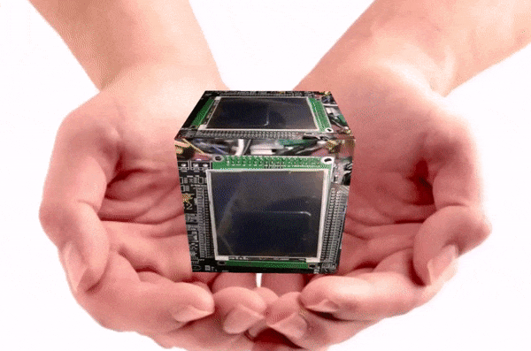
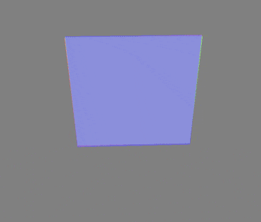
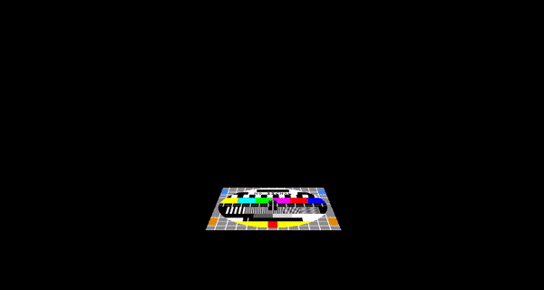

    

# GuiLiteWeb
- [GuiLite](https://github.com/idea4good/GuiLite) is the smallest GUI library with 5000 lines of C++ code, could run on **all platforms**(e.g, iOS, Android, Linux, Windows, macOS, Docker and **MCU with or without OS**).
- GuiLiteWeb inject GuiLite samples into Web page

## CubeEx

- Inject HelloParticle & HelloWave into Cube
- [Source code](CubeEx/main.js)
- Run it by open "CubeEx/index.html" with Microsoft Edge

## HelloParticle
- Inject Guilite Sample(HelloParticle) into Web page
- Run it by open "HelloParticle/src/main.html" with Microsoft Edge

## HelloWave
- Inject Guilite Sample(HelloWave) into Web page
- Run it by open "HelloWave/src/main.html" with Microsoft Edge

## Tutorial: How GuiLite graphic work?

- This 3D programm is used to show how GuiLite multi-layers work.
- [Video](https://www.youtube.com/watch?v=QzZJnU5KmDQ)
- [Source code](Graphic/main.js)
- Run it by open "Graphic/index.html" with Microsoft Edge

## Cube

- [Source code](Cube/main.js)
- Run it by open "Cube/index.html" with Microsoft Edge
