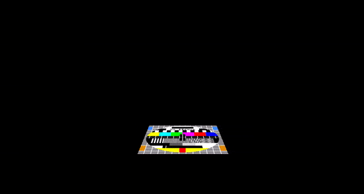

    

# GuiLiteWeb
- [GuiLite](https://gitee.com/idea4good/GuiLite)是最轻量，最简单，最稳定的GUI库，它只有5千行C++代码
- GuiLiteWeb将为GuiLite增加3D应用场景

## GuiLite 立方体

- [Source code](Cube/main.js)

## 教程：GuiLite底层绘制原理

- 通过3D程序，解释GuiLite滑动，及多层叠加原理
- [Source code](Graphic/main.js)